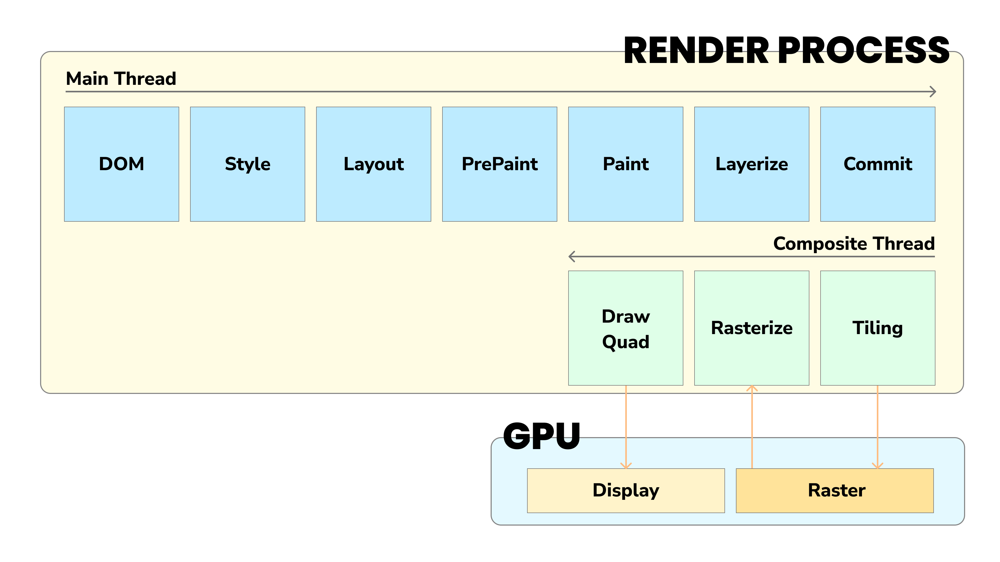

## 1. Web Browser Rendering Process

1. **브라우저**는 **서버**에 요청을 전송하기 위해 주소창을 제공하는데, 주소창에 URL을 입력하고 `Enter` 키를 누르면, **URL**의 **host(domain)** 이름이 **DNS**(물리적인 서버의 위치에 대한 요청을 판단하는 역할을 합니다. IP address로 바꿔주는 역할)를 통해 **IP 주소**로 변환되고, IP 주소를 갖는 **서버**에 요청을 전송합니다.
2. 즉, **브라우저**는 `HTML` `CSS` `JavaScript` 이미지, 폰트 등 렌더링에 필요한 **정적 리소스**를 요청하고, **서버**로부터 응답을 받습니다.
3. **브라우저의 렌더링 엔진**은 서버로부터 응답받은 `HTML` `CSS`를 Parsing하여 **DOM**과 **CSSOM**을 생성하고, 이 둘을 결합하여 `Render Tree`를 생성합니다.
4. **브라우저의 JS 엔진**은 서버로부터 응답받은 `JavaScript`를 파싱하여 `AST(Abstract Syntax Tree)`를 생성하고 바이트 코드로 변환하여 실행합니다. **DOM API**를 통해 **DOM**이나 **CSSOM**을 변경할 수 있습니다. 변경된 **DOM** 과 **CSSOM** 은 **Render Tree**에 다시 **재결합**됩니다.
5. 결합된 `Render Tree`를 기반으로, `HTML` 요소의 레이아웃을 계산 **Reflow** 하고, 브라우저 화면에 `HTML` 요소를 **Repaint** 하는 과정을 거치며 화면에 UI가 보여집니다.

 

### ☕️ Detail Description About HTML Parsing and DOM Generation

> ✅ **브라우저**의 요청에 의해 **서버**가 응답한 **HTML** 문서는 <b>문자열</b>로 이루어진 순수한 텍스트입니다.

이 순수한 텍스트를 브라우저 화면에 시각적인 픽셀로 렌더링하려면 `HTML` 문서를 브라우저가 이해할 수 있는 <b>자료구조(객체)</b>로 변환해서 <b>메모리</b>에 저장해야 합니다.

응답받은 `HTML` 문서를 파싱하여 브라우저가 이해할 수 있는 자료구조인 <b>DOM(Document Object Model)</b>을 생성합니다.

> **바이트** 코드 → **문자** → **토큰**(텍스트 문자) → **노드**(html, head, meta, link …) → **DOM**
>
> - 각 토큰들을 **객체**로 변환하여 **Node**들을 구성합니다. 토큰의 내용에 따라 문서 노드, 요소 노드, 어트리뷰트 노드, 텍스트 노드가 생성됩니다. **Node**는 **DOM을 구성하는 기본 요소**가 됩니다.
> - `HTML` 요소는 **중첩 관계**를 갖습니다. `HTML` 콘텐츠 영역에서는 텍스트 뿐만 아니라 다른 HTML 요소도 포함될 수 있습니다. `HTML` 요소 간의 **중첩 관계**에 의해 **부자 관계**가 형성됩니다.
> - 이러한 중첩 관계를 반영하여 모든 노드들을 **트리 자료구조 | DOM Tree**로 구성합니다. 이 노드들로 구성된 **트리 자료구조**를 `DOM`이라고 합니다.

### ☕️☕️ Then, What happened after Render Tree is combined?

> **DOM**과 **CSSOM**을 생성하고, `JavaScript` 코드에 작성된 **DOM API**에 의한 변경사항이 반영된 **Render Tree** 결합 이후 과정의 **세부적인 단계**까지 살펴보면 아래의 **다이어그램**과 같습니다.

> 아래의 키워드 중 **Raster**는 픽셀로 시각화하는 과정을 의미합니다.

위의 과정은 아래에서 언급할 **Reflow**와 **Repaint**를 설명할 기반이 됩니다.

 
 

## 2. Reflow & Repaint

브라우저의 렌더링 과정은 **웹 성능 최적화**를 위해 알아야 할 필수 과정입니다. 웹 성능 최적화를 위해서는 브라우저에서 진행되는 렌더링 과정 자체를 개선할 수 없기 때문에, 중간에 발생하는 **Bottleneck 현상**을 개선하는 것이 중요합니다.

웹 성능을 개선해야 하는 가장 큰 요소는 **Reflow**와 **Repaint**가 있습니다. 이 2가지는 주로, 최초 렌더링 이후 **스타일 변경**이나 **DOM 요소의 추가/삽입**으로 인해 발생합니다.

**DOM 파싱** 단계에서의 최적화를 다루면 좋지만, 현재로서는 쉽게 접근 가능한 **스타일 계산**과 같은 최적화 대상에 대해서만 다루겠습니다. 이후에 기회가 된다면, 제가 진행한 <b>[Vanilla Trello](https://github.com/olhkyle/trello)</b> 프로젝트를 진행하면서, **DOM**을 동적 생성했을 때 어떻게 효율적으로 렌더링할 수 있는 지에 대한 부분을 **DOM** 파싱 단계에서의 최적화와 같이 다뤄보겠습니다.

 

### 01 Reflow(리플로우)

> **👨‍🚀 레이아웃 계산을 다시하는 것에 해당되는 경우**
>
> 🔦 자바스크립트에 의한 **Node** 추가 / 삭제
>
> 🔦 **DOM** 요소의 크기(`width` `height`...) / 위치(`position`...) 변경
>
> 🔦 **Window** Resizing

#### 01-1 `document.body.appendChild(node)`

#### 01-2 `$elem.style.display = 'none'`

**웹 성능**을 결정하는 중요한 요소는 위의 다이어그램에서 보이는 **Main Thread 점유 시간과 여부**입니다. 첫 번째의 경우 **DOM**을 삽입하는 과정이 일어났기 때문에, 그리고 두 번째의 경우 **DOM**의 `display` **style** 속성이 `none`이 되었기 때문에, **Style** 단계는 물론 **Layout** 계산 과정도 모두 다시 수행됩니다.

 

### 02 Repaint(리페인트)

➡️ 재결합된 **Render Tree**를 기반으로 다시 **Paint**를 하는 것

#### 02-1 `$elem.style.backgroundColor = 'blue'`

이 예시의 경우 **Reflow** 과정과 달리 **Repaint** 과정이 발생하면 **Layout** 단계는 수행하지 않고 건너뛰어 **Paint** 단계부터 수행합니다. 이렇게 **Paint** 단계부터 재실행되는 것을 **Repaint**라고 부릅니다.

#### 02-2 `transform: translate3D(100%, 50%)`

이 예시의 경우, **Repaint** 과정이 발생하면 첫 번째 경우와 달리 **Layout** 부터 **Layerize** 과정은 건너뛰고, 복사된 **Commit** 레이어를 사용하여 렌더링하므로 상대적으로 빠르게 동작한다고 볼 수 있습니다. 이 경우에 해당하는 과정을 **Composition Only**, 즉 **합성**이라고 부릅니다. `transform` 속성뿐만 아니라 `opacity` 속성의 변경도 이 **Composition Only** 과정을 거칩니다.

> ✅ <b>합성(Composition)</b>은 웹 페이지가 어떻게 보여져야 할 지에 대한 정보를 **픽셀**로 **Rasterize** 한 후 **Composition Frame**을 생성하는 과정이라고 말할 수 있습니다.
>
> **Reflow**의 예시 중 두 번째 경우와 같이 **Main Thread** 단계를 건너뛰고 **복사된 Commit 레이어**를 바탕으로 **Composition Frame**을 생성하기 때문에, **CSS 애니메이션**은 사용자의 인터렉션을 방해하지 않는다는 것을 예상해 볼 수 있습니다. `JavaScript` 코드 중 비동기 처리에 의해 데이터를 받아오지 못해 비즈니스 Value를 보여주지 못하더라도, 우리가 부드러운 `CSS` 애니메이션을 볼 수 있는 이유입니다.

 
 

## 3. Conclusion

위와 같이 발생하는 **Reflow**와 **Repaint**를 발생시키는 요소들을 최소화할 수록 **웹 성능 최적화**를 이뤄낼 수 있다고 생각합니다. 하지만, 근래에는 다양한 `CSS` 애니메이션을 요구하는 서비스가 많아지면서 이를 당연히 피할 수 없을 것이라고 생각합니다.

그래도, **Bottleneck** 현상을 유발하는 과정들을 최소화하면, 서비스에서 제공하는 성능 최적화와 동시에 **UX** 측면에서 조금이나마 더 나은 서비스를 구현할 수있지 않을까라고 생각합니다. 이렇게 브라우저의 렌더링 과정과 렌더링 성능에 영향을 미치는 요인들에 대해서 정리해보았습니다.

 
 

### 🖼️ **Reference**

<b>[How does browser work step by step [latest] — optimization in the interaction stage (part 5)](https://cabulous.medium.com/how-does-browser-work-in-2019-part-5-optimization-in-the-interaction-stage-66b53b8ec0ad)</b>

 
 
