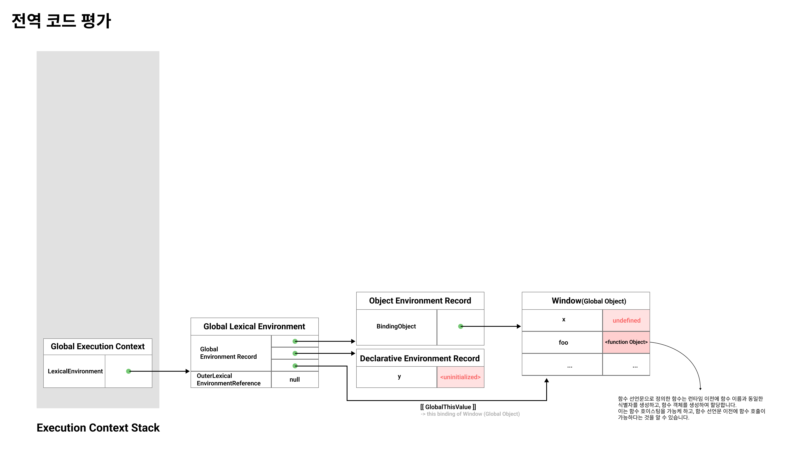
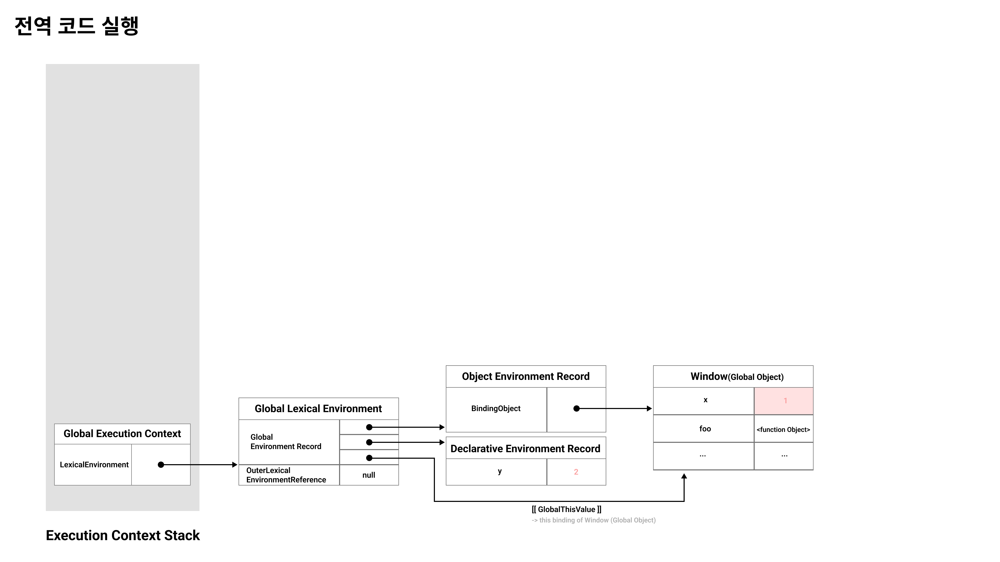
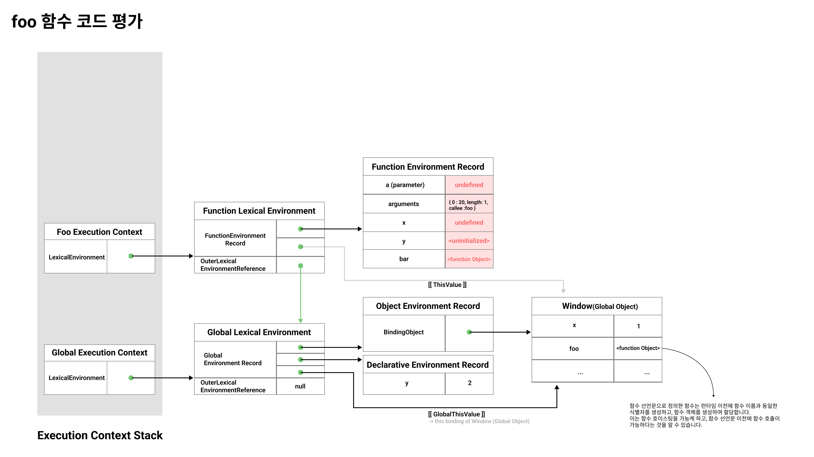
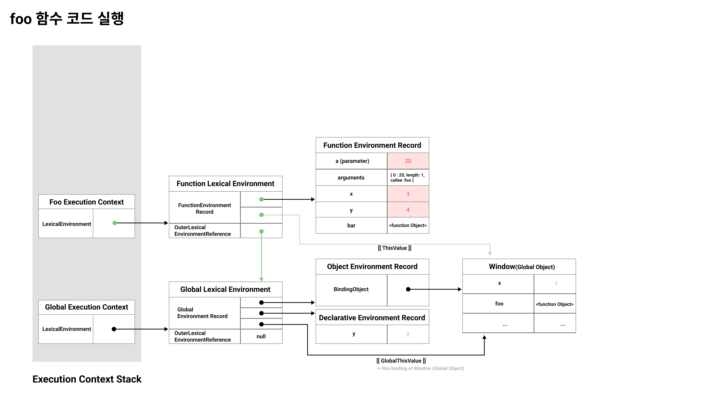
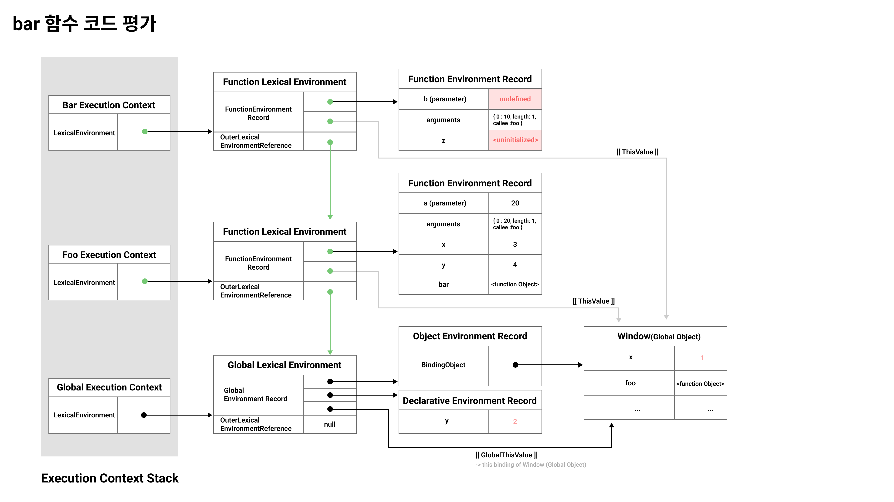
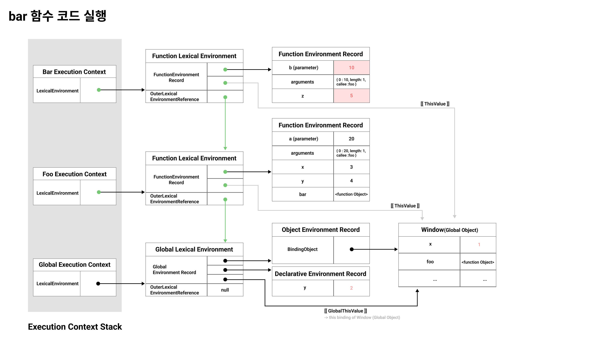
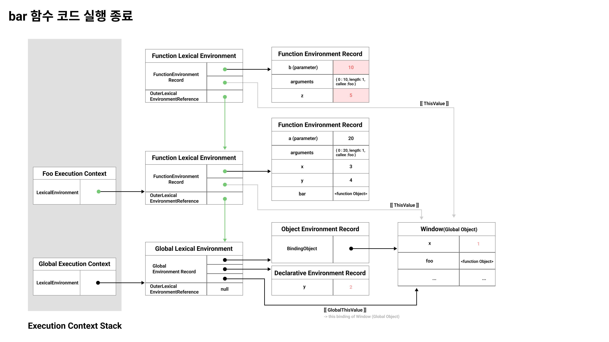
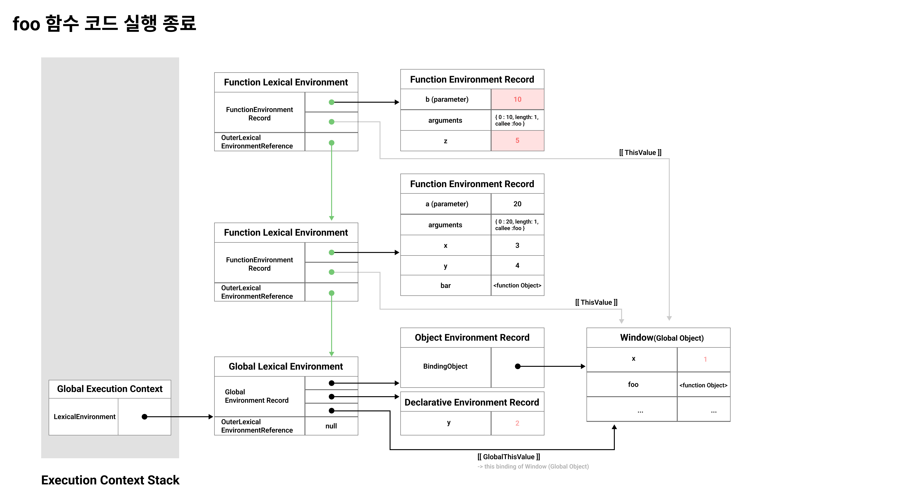
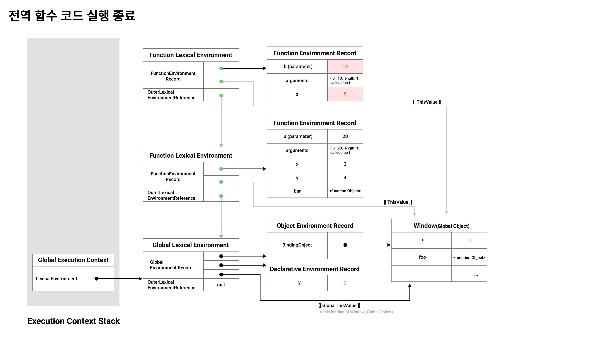

> `JavaScript`의 **코드 실행 순서** 그리고 **스코프**와 관련하여 이해도를 높이기 위해 이 글을 작성하게 되었습니다.

<br/>

## 1. About Execution Context

**실행 컨텍스트**는 **식별자**, **스코프**, 그리고 **코드의 실행 순서**를 관리하는 `JavaScript`의 핵심 개념입니다. **실행 컨텍스트**는 스코프를 기반으로 식별자와 식별자에 바인딩된 값, 스코프 체인, 클로저 동작 방식 등을 이해하는 데 도움이 됩니다.

> <b>실행 컨텍스트(Execution Context)</b>는 **자바스크립트의 4가지 소스코드**가 평가되면 생성됩니다.

> **전역 코드** | **함수 코드** | **eval 코드** | **모듈 코드**

<hr>
<br/>

일반적으로 **소스 코드 평가과정 / 런타임 이전**에는 변수, 함수 등의 선언문만 먼저 실행하여 생성된 변수와 함수를 키로 <b>실행 컨텍스트가 관리하는 스코프(렉시컬 환경의 환경 레코드)</b>에 등록합니다.

**소스 코드 실행과정 / 런타임**에는 선언문을 제외한 모든 소스 코드가 순차적으로 실행됩니다. 소스 코드 실행에 필요한 정보 즉, **변수**나 **함수**의 참조를 `스코프 체인`을 통해 검색하고, 필요한 **메서드**는 `프로토타입 체인` 상에서 검색하여 취득합니다.

<br/>

변수 값의 변경 등의 소스 코드 변경은 다시 실행 컨텍스트가 관리하는 <b>렉시컬 환경의 환경 레코드(Environment Record of Lexical Environment)</b>에 등록됩니다.

예를 들어, **소스코드 평가 과정**에서는 `var` 키워드로 선언한 변수에 `undefined`, `let`, `const` 키워드로 선언한 변수에는 `<uninitialized>`와 같이 표현되어 있습니다. 하지만, **소스코드 실행 과정**에서 할당문이 실행되므로 **값이 업데이트** 됩니다.

- 전역 코드인 경우 `Object Environment Record`의 `BindingObject` 객체에 등록된 `window` 전역 객체에 값이 업데이트

- 함수 코드인 경우 `Function Environment Record`에 해당 변수의 값이 업데이트

<br/>
<br/>

## 2. Whole Process of Execution Context's generation with Lexical Environment

다음의 코드 예시로, **실행 컨텍스트**가 실행 컨텍스트 스택에 언제 푸시되고, **렉시컬 환경**은 언제 생성되며, 변수에 대한 값은 언제 변경되는지, 그리고 **코드 실행 순서**는 어떻게 제어 되는지 확인해 보겠습니다.

```ts
var x = 1;
const y = 2;

function foo(a) {
	var x = 3;
	const y = 4;

	function bar(b) {
		const z = 5;
		console.log(a + b + x + y + z);
	}

	bar(10);
}

foo(20);
```

<br/>

### 01 전역 객체 생성

전역 코드 평가 이전에 전역 객체가 생성됩니다.

이 전역 객체에는 **빌트인 전역 프로퍼티**(e.g. `Infinity`,`undefined`, `NaN`), **빌트인 전역함수**(e.g. `isFinite`, `parseFloat`), **표준빌트인 객체** (e.g. `Object`, `Number`, `String`, `Boolean`, ...)가 추가되고, 환경에 따라 **호스트 객체** (브라우저 환경에서는 DOM, BOM, Canvas 와 같은 Web API / nodeJS 환경의 API)를 포함하게 됩니다. 이 전역 객체는 `Object.prototype` 을 상속받습니다.

<br/>

### 02 전역 코드 평가



1. **전역 실행 컨텍스트 생성**
   1. 전역 코드를 평가하면서, **비어 있는 전역 실행 컨텍스트**를 생성하고, 실행 컨텍스트 스택에 push 합니다. 실행 컨텍스트 스택의 최상위에존재하므로, **현재 실행 중인 실행 컨텍스트**라고 이야기 할 수 있습니다.
2. **전역 렉시컬 환경 생성**
   1. 전역 렉시컬 환경을 생성하고, 전역 실행 컨텍스트의 `LexicalEnvironment` 에 바인딩 합니다.
   2. **전역 환경 레코드 생성**
      1. **객체 환경 레코드 생성**
         1. 전역 환경 레코드를 구성하는 컴포넌트인 객체 환경 레코드는 `BindingObject` 라고 불리는 객체와 연결됩니다.
         2. 이 객체는 전역 객체 생성 단계에서 생성된 **전역 객체**라고 볼 수 있습니다.
         3. 전역 변수 `x` 와 `foo` 는 객체 환경 레코드를 통해 객체 환경 레코드의 `BindingObject` 객체에 바인딩 되어 있는 전역 객체의 프로퍼티와 메서드가 됩니다.
      1. **선언적 환경 레코드 생성**
         1. `let`, `const` 키워드로 선언한 변수는 전역 객체의 프로퍼티가 되지 않고, **개념적인 블록**에 존재하게 됩니다. 개념적인 블록은 전역 환경 레코드에 바인딩 되어 있는 **선언적 환경 레코드**라고 이야기 할 수 있고, `let`, `const` 키워드로 선언한 변수는 선언적 환경 레코드에 등록됩니다.
         2. `let`, `const` 키워드로 선언한 변수는 소스 코드 평가 과정에서 `<uninitialized>` 로 표시되어 있는데, 이 2가지 키워드로 선언한 변수는 런타임 이전(소스 코드 평가 과정)에 **선언 단계**와 **초기화 단계**가 분리되어 진행됩니다.
         3. 런타임에 변수가 선언되어 있는 스코프 선두로부터 변수 선언문(초기화 단계 - 할당)에 도달하기 전까지 **Temporal Dead Zone / TDZ**에 빠지게 됩니다.
         4. 이를 통해, 런타임에 `console.log`와 같은 API를 통해 변수를 참조하게 되면 **ReferenceError**가 발생하는 것을 확인할 수 있고, 이는 `let`, `const` 키워드로 선언한 변수도 호이스팅이 발생한다는 것을 알 수 있습니다.
   3. **this 바인딩**
      1. `[[GlobalThisValue]]` 라는 내부 슬롯에 `this`라는 식별자와 값을 연결하는 자기 참조 변수가 바인딩됩니다. `this` 는 전역 코드에 서 `window`, 즉 전역 객체를 가리키므로, 내부 슬롯에는 전역 객체가 바인딩 됩니다.
   4. **외부 렉시컬 환경에 대한 참조 생성**
      1. 외부 렉시컬 환경에 대한 참조는 현재 평가 중인 소스 코드를 포함하는 **외부 코드의 렉시컬 환경**, 즉 **상위 스코프**를 가리킵니다.
      2. 이를 통해 **단방향 링크드 리스트** 형태인 **스코프 체인**을 구현합니다.

<br/>

### 03 전역 코드 실행



1. **전역 코드 실행**
   - 런타임 단계로 선언문을 제외한 모든 코드가 실행되기 시작하여, 식별자 결정을 통해 실행 중인 실행 컨텍스트의 렉시컬 환경에 존재하는 식별자를 검색합니다.
   - 현재는 해당 렉시컬 환경에 `x`와 `y`라는 변수가 존재하기 때문에, `x`라는 변수에는 1이라는 값이 할당되고, 선언적 환경레코드에 등록되어 있던 `y`라는 변수에는 2라는 값이 할당됩니다.
   - 하지만, 존재하지 않는 경우 **외부 렉시컬 환경에 대한 참조**를 통해 상위 스코프로 이동하여 식별자 결정을 통해 식별자를 검색하게 되는데, 전역 렉시컬 환경은 스코프 체인의 종점이기 때문에, 상위 스코프가 존재하지 않아, 해당 렉시컬 환경에 존재하지 않는 변수를 참조하게 될 경우 **ReferenceError** 를 발생시키게 됩니다.
2. **`foo` 함수로 코드의 제어권 이동**
   - foo 함수 호출문이 실행되어 코드의 제어권이 foo 함수로 이동하게 됩니다.

<br/>

### 04 foo 함수 코드 평가



1. **foo 함수 코드 평가**
   1. **함수 실행 컨텍스트를 생성**
      1. 단, 함수 실행 컨텍스트는 함수 환경 레코드가 생성될 때까지 실행 컨텍스트 스택에 push 하지 않습니다.
   2. **함수 렉시컬 환경 생성**
      1. 함수 렉시컬 환경을 생성하고, 함수 실행 컨텍스트의 LexicalEnvironment에 바인딩 합니다.
      2. **함수 환경 레코드 생성**
         1. 함수 렉시컬 환경을 구성하는 컴포넌트인 함수 환경 레코드는 **매개변수**, `arguments` 객체, 함수 내부에 선언한 **지역 변수**와 **중첩 함수**를 등록하고 관리합니다.
      3. **this 바인딩**
         1. `[[ThisValue]]` 내부 슬롯에는 `foo` 함수 내부의 `this`가 바인딩 됩니다. `foo` 함수는 일반 함수로서 호출되기 때문에 `this` 에는전역 객체(`window`)가 바인딩 됩니다. (`this` 는 **함수 호출 방식**에 따라 동적으로 결정된다.)
         1. **외부 렉시컬 환경에 대한 참조**
            1. 전역 코드 평가 단계에서 `foo` 함수가 전역 객체의 프로퍼티(메서드)로 할당될 때, 런타임 이전(소스 코드 평가 단계)에 함수 정의가평가되면서 함수 이름과 동일한 식별자가 생성되고, 이 식별자에 함수 객체를 생성하여 할당하게 됩니다.
            2. 함수 객체 생성 시, 현재실행 중인 실행 컨텍스트의 렉시컬 환경, 즉 `foo` 함수의 상위 스코프(여기서는 전역 렉시컬 환경)를 `[[Environment]]` 라는 내부 슬롯에 저장합니다.
            3. 위의 과정을 통해, `foo` 함수가 호출되어 `foo` 함수 코드를 평가하는 단계에 외부 렉시컬 환경에 대한 참조에 할당되는 것은 `[[Environment]]` 내부 슬롯에 저장된 렉시컬 환경에 대한 참조 입니다. 이것이 바로 렉시컬 스코프, **함수가 어디서 정의되었는지**에 따라 **상위 스코프**를 결정하는 메커니즘입니다.

<br/>

### 05 foo 함수 코드 실행



1. **foo 함수 코드 실행**

   1. `foo` 함수의 소스 코드가 실행되기 시작하여, **매개변수**에는 **인수**가 할당되고, **변수 할당문**이 실행되어 지역 변수 `x`, `y` 에 값이 할당되며, `bar` 함수가 호출됩니다.

2. **bar 함수로 코드의 제어권 이동**

<br/>

### 06 bar 함수 코드 평가



1. **`bar` 함수 코드 평가**
   1. **함수 실행 컨텍스트를 생성**
      1. 단, 함수 실행 컨텍스트는 함수 환경 레코드가 생성될 때까지 실행 컨텍스트 스택에 push 하지 않습니다.
   2. **함수 렉시컬 환경 생성**
      1. 함수 렉시컬 환경을 생성하고, 함수 실행 컨텍스트의 LexicalEnvironment에 바인딩 합니다.
      2. **함수 환경 레코드 생성**
         1. 함수 렉시컬 환경을 구성하는 컴포넌트인 함수 환경 레코드는 **매개변수**, `arguments` 객체, 함수 내부에 선언한 **지역 변수**와 **중첩 함수**를 등록하고 관리합니다.
      3. **this 바인딩**
         1. `[[ThisValue]]` 내부 슬롯에는 `bar` 함수 내부의 `this`가 바인딩 됩니다. `bar` 함수는 일반 함수로서 호출되기 때문에 `this` 에는 전역 객체(`window`)가 바인딩 됩니다. (`this` 는 **함수 호출 방식**에 따라 동적으로 결정된다.)
         1. **외부 렉시컬 환경에 대한 참조**
            1. `foo` 함수 코드 평가 단계에서 `bar` 함수는 함수 정의를 평가하여 함수 이름과 동일한 식별자를 생성하고, 함수 객체를 생성하여 할당 하는데, 이 때 현재 실행 중인 실행 컨텍스트의 렉시컬 환경, 즉 `bar` 함수의 상위 스코프(`bar` 함수가 정의되어 있는 `foo` 함수의 렉시컬 환경)을 `[[Environment]]` 내부 슬롯에 저장합니다.
            2. 위의 과정을 통해, `bar` 함수가 호출되어 `bar` 함수 코드를 평가하는 단계에 외부 렉시컬 환경에 대한 참조에 할당되는 것은 `[[Environment]]` 내부 슬롯에 저장된 렉시컬 환경에 대한 참조 입니다. 이것이 바로 렉시컬 스코프, **함수가 어디서 정의되었는지**에 따라 **상위 스코프**를 결정하는 메커니즘입니다.

<br/>

### 07 bar 함수 코드 실행



1. **`bar` 함수 코드 실행**
   1. `bar` 함수의 소스 코드가 실행되기 시작하여, 매개변수 (`b`)에 인수가 할당되고, 변수 할당문이 실행되어 지역 변수 `z`에 값이 할당되며 `console.log` 가 호출된다.
2. **console 식별자 검색, log 메서드 검색 및 호출**
   1. 현재 실행 중인 실행 컨텍스트의 렉시컬 환경 내에서 `console` 이라는 식별자가 존재하는 지 확인합니다. 해당 렉시컬 환경에 존재하지 않으므로, 외부 렉시컬 환경에 대한 참조를 따라, 즉 **스코프 체인** 을 통해 `foo` 함수의 렉시컬 환경으로 이동하여 검색하고, `foo` 함수의 렉시컬 환경에도 존재하지 않기 떄문에, `foo` 함수의 렉시컬 환경에서 외부 렉시컬 환경에 대한 참조를 따라 전역 렉시컬 환경으로 이동하
      여 `console` 식별자를 객체 환경 레코드의 `BindingObject` 객체에 바인딩 된 전역 객체를 검색합니다.
   2. `console` 식별자는 전역 객체에 존재하는 것을 확인할 수 있습니다. 이어서, 해당 식별자의 마침표 표기법 뒤에 있는 `log` 메서드를 **프로토타입 체인**을 통해 메서드를 검색합니다. `log` 메서드는 상속받은 프로퍼티에 존재하지 않고, 객체가 직접 소유한 프로퍼티입니다.
   3. 그리고, `log` 메서드에 전달한 `a + b + x + y + z` 인수인 표현식을 평가하기 위해 각각의 식별자를 현재 실행 중인 실행 컨텍스트부터 시작하여 식별자를 검색하기 시작합니다. 즉, 현재 실행 중인 실행 컨텍스트, `bar` 함수 호출에 의해 `bar` 함수 코드 평가 단계에서 생성된 실행컨텍스트의 렉시컬 환경부터 시작하여, **외부 렉시컬 환경에 대한 참조로 연결되는 스코프 체인**을 따라 식별자를 검색합니다. 4.`a`
      식별자는 `foo` 함수의 렉시컬 환경, `b` 식별자는 `bar` 함수의 렉시컬 환경, `x` 와 `y` 식별자는 `foo` 함수의 렉시컬 환경에서, `z` 식별자는 `bar` 함수의 렉시컬 환경에서 검색합니다. 해당되는 값들로 표현식을 평가한 후 `log` 메서드에 전달하여 최종적으로 호출합니다.

<br/>

### 08 bar 함수 코드 실행 종료



1. **bar 함수 코드 실행 종료**

   1. `console.log` 메서드 호출 이후, `bar` 함수 내부 코드에는 더 이상 실행할 코드가 없으므로, `bar` 함수의 코드 실행이 종료되고, 현재 실행중인 실행 컨텍스트인 `bar` 함수의 실행 컨텍스트는 실행 컨텍스트 스택에서 pop 되어 제거되며, `foo` 함수의 실행 컨텍스트가 현재 실행 중인 실행 컨텍스트가 됩니다.

2. **bar 함수 렉시컬 환경의 임시적 생존**
   1. 실행 컨텍스트 스택에서 `bar` 함수 실행 컨텍스트가 제거되었다고 해도, `bar` 함수의 렉시컬 환경까지 즉시 소멸되지 않습니다.
   2. 그 이유는 렉시컬 환경은 실행 컨텍스트의 `LexicalEnvironment` 에 의해 참조되기는 하지만, 렉시컬 환경도 별도의 독립적인 객체라고 볼 수 있습니다.
   3. 누군가에 의해 참조되지 않을 때 제거 되는데, 현재는 `bar` 라는 함수 정의가 `foo` 함수 실행 컨텍스트에 바인딩 된 `foo` 함수 렉시컬 환경의 함수 환경 레코드 내 식별자에 함수 객체가 할당되어 있으며, `this` 바인딩을 통해 `[[ThisValue]]` 내부 슬롯에 전역 객체를 바인딩 하고있기 때문에, 바로 사라지지 않습니다.
   4. 이는 **클로저**와 연결되기 때문에 중요합니다.

<br/>

### 09 foo 함수 코드 실행 종료



1.  **foo 함수 코드 실행 종료**

    1.  `bar` 함수가 종료되면 `foo` 함수 내부의 코드도 실행할 코드가 없으므로, `foo` 함수 코드도 실행을 종료합니다. 그리고 `foo` 함수 실행컨텍스트가 실행 컨텍스트 스택에서 pop 되어 제거되고, 전역 실행 컨텍스트가 현재 실행 중인 실행 컨텍스트가 됩니다.

2.  **foo 함수 렉시컬 환경의 임시적 생존**
    1.  `bar` 함수의 렉시컬 환경과 유사하게 누군가에 의해 참조되고 있기 때문에, 실행 컨텍스트와 같이 바로 사라지지 않습니다.

<br/>

### 10 foo 함수 코드 실행 종료



1. **전역 코드 실행 종료**
   1. `foo` 함수가 종료되면 전역 코드 내에서 더 이상 실행할 코드가 없기 때문에, 전역 코드의 실행이 종료되고, **전역 실행 컨텍스트**도 실행컨텍스트 스택에서 pop되어 제거되어 실행 컨텍스트에는 아무 것도 남아있지 않게 됩니다.

<hr>

<br/>

## 3. Conclusion

**실행 컨텍스트**, **렉시컬 환경**, **환경 레코드**, **식별자**, **스코프**, **스코프 체인**, **프로토타입 체인** 등 많은 `자바스크립트`와 관련된 용어들이 사용되고 있습니다. **실행 컨텍스트에 대한 이해**는 마치 `자바스크립트` 코드가 바이트 코드로 변환되어 기계가 읽는 것처럼, 개발자가 **코드의 실행 순서**를 이해하는데 도움이 된다고 생각합니다.

**실행 컨텍스트**와 **렉시컬 환경** 그리고 **스코프**는 **클로저**와 연결되는 개념이기 때문에, 이렇게 정리하게 되었습니다. 미래의 저에게 도움이 되었으면 좋겠습니다.

<br/>
<br/>
