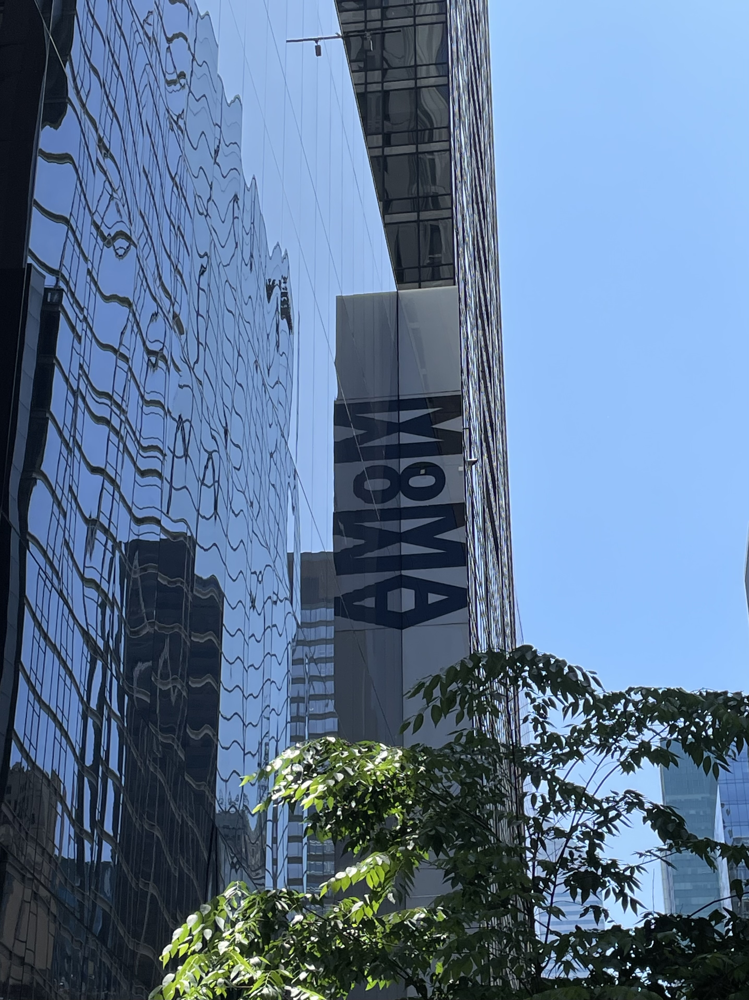
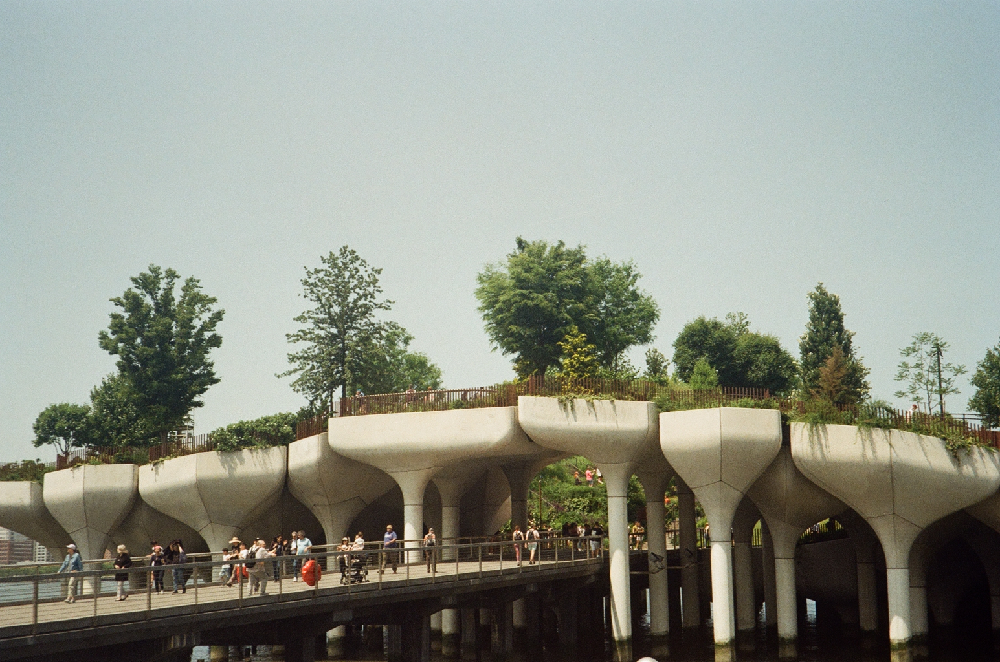
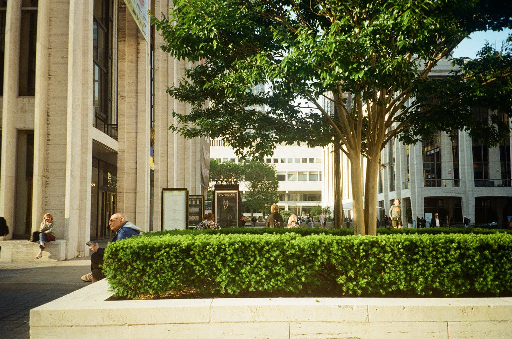
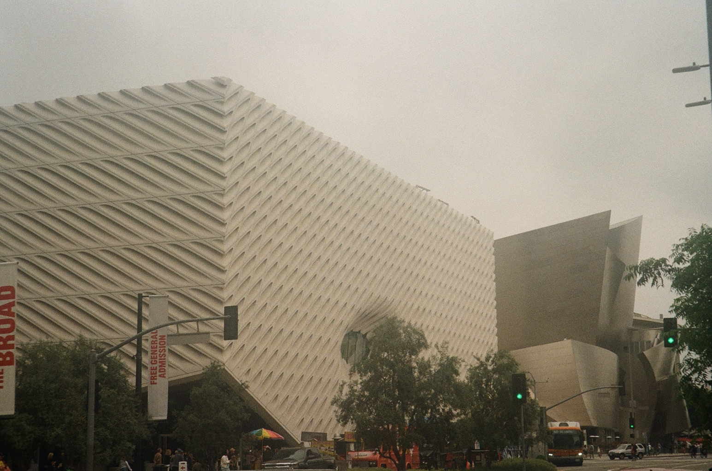

## 8개월간 무엇을 했는가

### 작년 하반기

작년 하반기에는 **<a href="http://www.gansam.com/" target="_blank">한 건축 사무소</a>** 에서 한달 간의 **인턴** 생활을 보낸 후, 건축학과의 **마지막 학년**을 마무리하면서 **온라인 부트캠프**를 병행했다. 상반기에 졸업 전시를 끝냈던 터라, 남은 학교 강의가 많지 않아 병행할 만하였다. 다만, 자바스크립트에 대해서 처음 배우던 터라 알고리즘과 병행하고 있었는데 중간중간 포기하고 싶은 상황도 많았고 정말 쉽지
않았다.

작년의 막바지에 운 좋게, 온라인 부트캠프에서 진행하던 백엔드와의 **[첫 프로젝트 협업 경험](https://github.com/MinWonHaeSo/ESC_CLIENT)** 기회와 모던 자바스크립트 딥다이브 저서이신 이웅모 강사님으로부터 코칭을 받는 부트캠프 **오프라인 과정**에 합격하게 되었다.

첫 프로젝트 협업은 좋은 팀원들을 만나 프로젝트를 성공적으로 마무리 할 수 있었다. 자바스크립트에 대한 이해도가 그리 높지 않은 상태에서, 타입스크립트와 리덕스 툴킷을 도입하는 바람에 매우 힘들었지만, 협업도 해보는 소중한 기회였고, 서비스 하나를 온전하게 만들어볼 수 있었다는 점, 그리고 개인적으로도 자바스크립트와 리액트를 실질적으로 사용해보며 이해도를 높일 수 있었다는 것이 좋았다.

 

### 1월

2023년 1월이 되어 **오프라인 과정**에 참여하게 되었다. 1월 한달 간은 1000페이지 가량 되는 모던 자바스크립트 딥다이브를 독파하는 경험을 하였다. 책을 읽으면서 작년 하반기에 내가 배우고 익힌 자바스크립트는 진짜 세발의 피도 안된다는 것을 뼈저리게 느끼게 되었다. 첫 주는 책을 읽는 것 자체도 힘들었지만, 처음 접하는 개념과 언어의 기술적인 부분들에 쉽지 않구나라는 것을 느꼈다.

그래도 책을 읽으면서 좋았던 점은 오프라인 과정에서 배운 개념과 기술을 발산하는 환경을 제공해주셨다는 점이다. 오전에 러버덕이라는 과정을 통해 전날 읽은 부분에 대해 서로가 이해하고 알게된 부분을 설명하였다. 이 과정은 내가 개념을 제대로 이해하고 있는 가 검토할 수 있는 시간이었고, 개발 공부를 하고 있는 지금도, 머릿 속에 저장되어 있는 언어에 대한 개념들을 바탕으로 코드를 작성할 수 있는 큰 원동력이 되고
있다.

 

### 2월 ~ 5월

드디어 다사다난했던 8년 간의 학교 생활을 마무리하는 **졸업**을 하게 되었다. 그리고 1달 간의 딥다이브 책 독파 이후, 약 3개월 간 자바스크립트와 리액트를 활용한 다양한 UI를 만드는 경험, 그리고 리액트를 활용한 팀 프로젝트를 경험하였다. 강사님의 코칭 하에 생각하면서 코드를 작성하는 힘을 기르고, 자바스크립트에 대한 이해도를 높이며, 협업을 통해서 서로에게 배울 점이 많다는 것을 알 수 있는 계기가 되었다.

어떤 서비스를 구현해야 한다면 왜 해당 기술을 사용해야 하고, 적용해야 하는 지 설명하는 과정들은 필수적이며, 코드 한줄 한줄 작성할 때도 생각하면서 작성하게 되는 기반을 갖추게 된 것 같다.

5월 오프라인 과정 수료 후, 진행했던 팀 프로젝트를 더 업그레이드 하자는 이야기가 팀에서 나와 팀원들이 생각하는 좋은 UI / UX를 반영한 커뮤니티 프로젝트로 만들기로 하였다. 기획 수정부터, 기능 추가, 그리고 배포까지 여유롭게 3주 간의 시간을 두고 프로젝트를 업그레이드하여 마무리 하였다.

그리고 정말 고대하던 5월 24일 **뉴욕**으로 떠나게 되었다. 초등학교 때부터 알고 지낸 미국에서 현재 거주하고 있는 3명의 친구와 뉴욕에서 만났다. 다 같이 모인건 진짜 중학교 이후 처음이지 않을까 싶다.

미국으로 가게 된 이유는 재작년부터 **디스크 판정**을 받은 이후에도 내 건강을 핑계로 그만두지 않고, 꿋꿋이 학교를 졸업하고, 프로그래밍 분야에 들어서서 나름 열심히 성장하며 지내면서, 한 번도 제대로된 휴식을 갖은 적이 없었기 때문이다. 집 그리고 개인적인 이유(해외에서 거주, 일하고 싶은 것, 그리고 여행)도 있었고, 내 스스로에 대한 보상 차원에서 떠났다.

뉴욕에 가서는 **MOMA** 레스토랑에서 일하는 친구 덕에 MOMA 레스토랑에서 인생 첫 파인 다이닝 체험도 하고, 현재는 디트로이트에 위치한 자동차 회사에 일하는 베프의 어릴적 친구가 뉴욕에 위치한 클라우드 컨설팅 회사에 일하고 있어, 이 친구와 만나 이전에 백엔드 개발자로서 했던 경험에 대해서도 들을 수 있었다.

 

4년 만에 뉴욕에 왔던 터라 관광도 할 겸 내가 한국에서 온다고 소중한 휴가까지 내고 온 친구들과 이곳저곳 돌아다니면서 사진을 참 많이 찍었다. 5월의 뉴욕은 날씨가 정말 좋았다. 이번 방문 이전의 지금까지 방문했던 뉴욕은 한 여름이거나 한 겨울이었는데, 이번엔 비가 한 번도 오지 않을 정도로 날씨가 너무 좋아, 친구들이 먼저 돌아가고 난 뒤 혼자 정말 많이 걸어다녔다.

 
 

독일 교환학생 갔을 때 정말 많이 걸었었는데, 그 때 기억이 새록새록 떠올랐다.

 
 

뉴욕에서 열흘 정도 지내고 **LA**로 넘어가게 되었다. LA에서는 정말 충분한 휴식을 가졌다. 디트로이트 자동차 회사에서 일하는 친구의 동생과도 어릴 적부터 친하게 지내고, 한국에서도 영어로 매주 영어 회화를 도와주고 있었기에 자연스럽게 동생 집에 머물 수 있게 되었다.

더 넓은 세상에서 평화로운 곳에서 충분한 휴식을 갖게 되어 너무 좋았다. 정말 간만에 느끼는 평화로움이었다.

 

### 6월

그리고 6월 중순 즈음, 돌아와 네이버 부스트캠프 코딩테스트, 그리고 프로그래머스 데브 매칭을 지원하였다. 부스트캠프는 확실히 전공자로서의 컴퓨터 공학적 지식을 많이 물어보았기에 빠르게 탈락하였고, 데브 매칭은 운좋게 테스트를 통과하여 10곳에 이력서를 넣을 수 있게 되었었다.

이력서를 넣을 당시 개발자로서의 경력도 없을 뿐만 아니라, 프로젝트도 2개밖에 진행하지 않아 지원해도 맞는 것인지 모르겠지만 지원하였다.

 

### 7월

운 좋게 데브 매칭을 통해 한 대기업으로부터 면접 기회를 얻게 되었다. 그리고 2023 토스 NEXT 개발자 챌린지에 지원하였다. 3시간 가량 진행된 온라인 테스트는 만 3년차 수준의 프론트엔드 개발 능력을 요하였기에 3시간 안에 완성하는 것은 정말 무리가 있었다. 그만큼 내가 많이 부족하구나라는 것을 느꼈고, 아직 시간이 많이 필요하구나라는 것을 느꼈다.

이후에 개인적으로 다시 풀어보게 되었는데, 시간만 있었다면 충분히 풀 수 있었던 문제였음에도 불구하고 풀지 못했으므로, 정말 많이 노력해야겠구나라는 생각을 하게 되었다.

그리고 7월 중순 좋은 일로 잠시 3박 5일간 **싱가포르**를 다녀오게 되었다. 동남아의 뉴욕이라더니 엄청 깨끗하고 일단 영어를 사용할 수 있다는 점이 좋았다. 하지만, 가자마자 엄청난 비가 내리 부어, 역시 동남아는 비가 많이 오고 덥다는 것을 확실히 각인하게 되었다.

 

### 8월

데브 매칭을 통해 갖게된 면접 기회 덕에 2시간 동안 **라이브 코딩**과 **기술 면접을** 진행하였다. **FAANG**이라고 불리는 미국의 대기업들은 이 라이브 코딩을 정말 많이 진행한다는데, 그래도 면접 기회를 얻게 되었다는 것에 기대감이 컸었다.

정말 제대로된 첫 라이브 코딩 면접 기회였기에 긴장도 많이 하였다. 면접을 보면서 느꼈던 점은 4개월 간 오프라인 과정에서 모던 자바스크립트 딥 다이브를 활용해 기술에 대한 이해도를 높이고, 바닐라 자바스크립트를 활용해 이런저런 UI 컴포넌트를 만들어 봤던 경험이 헛되지 않았구나를 느끼게 되었다.

라이브 코딩 과정에서 요구사항의 80% 밖에 구현하지 못했지만, 그래도 내가 무언가를 주어진 시간 내에 구현할 수 있다는 자신감을 갖게 되었고, 기술 면접에서도 자바스크립트에 대한 이해도를 어느 정도 갖고 있구나라는 것을 느끼게 되었다.

이 면접으로 자신감도 많이 얻긴 했지만, 내 개인 웹페이지, 블로그, 그리고 개인 프로젝트를 만드는 동시에, 면접 준비까지 하였던 터라 그만큼 많은 에너지를 썼는 지 번아웃이 또 다시 찾아오게 되었다.

`Gatsby`를 활용해 `SSR`과 `SSG`를 경험하면서 블로그를 만들어보고 싶어, 지금 보여지는 이 블로그를 만들게 되었고, 내 개인 이력과 이전 경험 그리고 포트폴리오를 보여주는 웹사이트 **[Olhkyle.me](https://olhkyle.me)** 를 만들었는데, 이것들과 알고리즘 테스트, 이력서 지원, 그리고 기술 면접 준비를 병행하면서 그만큼 에너지를 많이 쓰게된 것 같다.

약 3주 가까이 간간히 코딩테스트 1 ~ 2문제 푸는 것, 그리고 개인적으로 이전부터 건축 관련해서 하고 있던 일 ([Designthou](www.designthou.com)) 이외에는 아무것도 하지 않고, 푹 쉬었다. 글을 작성하고 있는 지금은 다시 시동을 거는 중이다. 언제나 그렇듯 다시 시작할 때 상당히 고되고 힘들지만, 그래도 너무 욕심내지 않고 꾸준히 하다보면 또 좋은 기회가 오지 않을까 생각한다.

 
 

## 번아웃

내가 무엇을 하고 살았는 지 기억하기 위해 그리고 돌아보기 위해, 노션에 기록하는 것을 종종 하곤 하는데, 예외적으로 블로그에 업로드하게 되었다. 주저리 주저리 작성하게 된 것 같은데, 이렇게 한 번 나 스스로를 돌아봤다는 점에서 그래도 조금은 성장했다는 것을 느낄 수 있지 않았을까?

건축 작업에서 프론트엔드 개발로 넘어온 계기를 생각해보면, `시각적인 것을 구현하는 것`에 항상 재미를 느끼고 관심 있어 하던 중, 건축을 표현하는 수단으로서 다양한 툴들을 사용하면서, 이 툴들이 갖는 `UI/UX` 에 대한 관심이 크게 생겼다. 자연스럽게 훌륭한 UI/UX를 실질적으로 구현해내는 프론트엔드 개발에 빠져들었다.

> **🏢 Architecture Tools**
>
> AutoCAD, Rhino, SketchUp, Vray, Enscape, Adobe Collection

때때로, **프론트엔드** 분야도 결국 시각적인 것을 구현하게 되는 것이고, 내 안의 내재적인 성향이 이것에 매료되어 자연스럽게 나를 프론트엔드 개발로 이끌게 된 것 같은데, 건축 작업을 하면서 갖게 되었던 개인적인 회의감을 똑같이 갖게 되지 않을까라는 생각이 들기도 한다.

나름 건축 공간도 구성해보고, 인테리어 공간도 기획해보고, 공모전 수상도 해보고 했지만, 결국은 누군간의 일방적인, 어떠한 의미도 담지 않는 그리고 중요하지 않는 것에 초점을 맞추는 주관적인 주장에 의해 일단락 되어 버리는 건축이라는 분야에 회의감을 갖게 되었었다. 시각적인 것을 표현하는 것들의 근본적인 문제는 앞서 이야기한 이러한 점이 아닐까라고 생각된다.

하지만, 한 편으로는 건축이라는 분야에 학생으로서 그리고 현업자로서 약 8년 간 몸담았지만, 프론트엔드 분야는 이제 1년 경험하였기에 섣부른 판단이 아닐까라는 생각도 든다. 그래서 다시 시작하는 나는 지금 잠깐 이러한 생각을 접어두고 차근차근 진행하려 한다.

경력이 없기에 퀄리티 좋은 프로젝트 경험들을 쌓고, 알고리즘 공부도 꾸준히 하면서 이력서를 지원하는 방법 밖에 없는 것 같다. 조급했기에 번아웃이 왔던 게 아닐 까.

 

## 앞으로 할 것

앞으로 남은 2023년의 하반기 동안 **타입스크립트**에 대한 이해도도 높이고, 현재 트렌드로 잡고 있는 **SSR**에 대한 이해도도 높여야 하며, 좋은 회사에 들어가기 위해서 필수적인 알고리즘 공부도 꾸준히 해야 한다. 그리고 당연한 **자바스크립트**! 자바스크립트는 당연히 잘해야 한다.

현재 **[ExPace](https://github.com/olhkyle/expace-fe)** 라는 프로젝트를 진행 중이다. 미래에 **우주 여행**이 현실화 될 가능성들을 **TESLA** 와 같은 기업에서 많이 보여주고 있는데, 현재는 당연시 되고 있는 비행기 여행이 우주 여행으로 뻗어나갔을 때, 경험할 수 있도록 도와주는 서비스가 있으면 어떨까하는 계기에서 시작하게 되었다.

웹 단계에서 잘 마무리가 되면, `React Native` 혹은 `IOS`를 도입해 서비스를 만들어 볼 수있지도 않을 까 생각한다.

프론트엔드는 지금 많은 라이브러리와 프레임워크 등등 **춘추 기술 전국 시대**이기 때문에 배워야할 기술들이 정말 많다. 하지만, 그 중 근간이 되는 자바스크립트와 타입스크립트에 대한 이해도를 높이는 게 가장 중요하지 않을 까 싶다.

개인적으로 갖고 있는 생각들을 모두 여기에 풀어내는 것이 부담스럽긴 하지만, 개발과 관련해서는 이렇게 가끔 풀어놓을 것 같다. 앞으로 **꾸준히 구체화된 성장**을 했으면 한다.
