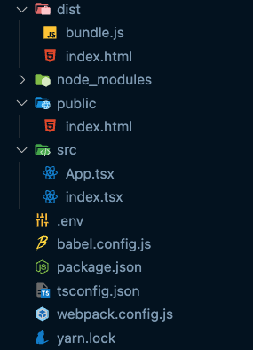
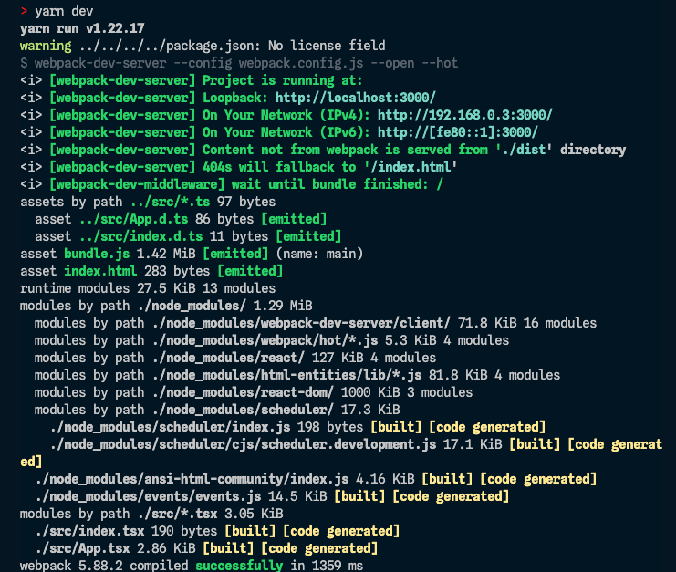
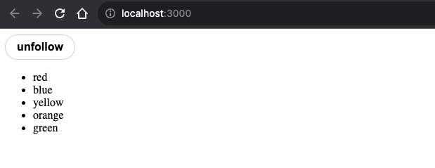

> <b>CRA(Create React App)</b> 그리고 <b>Vite, Rollup</b>와 같은 번들링 도구 없이 <b>babel</b>과 <b>webpack</b>을 활용하여 직접 <b>`React` + `TypeScript`</b> 개발 환경을 구축해보는 방법에 대해서 정리하였습니다.

<br/>

## 1. Package Manager & Package Configuration

```ts
// package.json 파일 생성
$ yarn init

// react & react-dom 설치
$ yarn add react react-dom

// index.html 구성
$ mkdir public && public/ && touch index.html

// src 디렉토링 생성 및 React의 Entry Point가 될 Index.tsx 파일 생성
$ mkdir src && cd src/ && touch Index.tsx

// Root Component가 될 App.tsx 파일 생성
$ touch App.tsx
$ cd ..

```

### 1-1. `index.html`

```html
<!DOCTYPE html>
<html lang="ko">
	<head>
		<meta charset="UTF-8" />
		<meta name="viewport" content="width=device-width, initial-scale=1.0" />
		<meta name="theme-color" content="#fff" />
		<title>WithoutCRA-TS</title>
	</head>
	<body>
		<div id="root"></div>
	</body>
</html>
```

### 1-2. `index.tsx`

```tsx
import ReactDOM from 'react-dom/client';
import App from './App';

ReactDOM.createRoot(document.getElementById('root')!).render(<App />);
```

### 1-3. `App.tsx`

> 테스트를 위해 다음과 같은 코드를 작성하였습니다.

```tsx
import { useState } from 'react';

const commonBtnStyle = {
	display: 'flex',
	justifyContent: 'center',
	alignItems: 'center',
	width: '100px',
	height: '36px',
	fontSize: '16px',
	fontWeight: 'bold',
	borderRadius: '9999px',
};

const followBtnStyle = {
	...commonBtnStyle,
	backgroundColor: 'black',
	color: 'white',
};

const unfollowBtnStyle = {
	...commonBtnStyle,
	backgroundColor: 'white',
	color: 'black',
	border: '1px solid #cfd9de',
};

const App = () => {
	const [following, setFollowing] = useState(false);

	return (
		<div>
			<button style={following ? followBtnStyle : unfollowBtnStyle} onClick={() => setFollowing(!following)}>
				{following ? 'follow' : 'unfollow'}
			</button>
			<ul>
				<li>red</li>
				<li>blue</li>
				<li>yellow</li>
				<li>orange</li>
				<li>green</li>
			</ul>
		</div>
	);
};

export default App;
```

<br/>
<br/>

## 2. TypeScript Configuration

```bash
// TypeScript & React에서 TypeScript를 지원하기 위한 @types/react & @types/react-dom 설치
$ yarn add typescript @types/react @types/react-dom --dev

// TypeScript 초기화 & tsconfig.json 파일 생성
$ tsc --init
```

### 2-1. `tsconfig.json`

```json
{
	"compilerOptions": {
		/* Modules */
		"baseUrl": ".",
		"paths": {},
		"module": "esnext",
		"moduleResolution": "nodenext",
		"resolveJsonModule": true,

		/* Type Checking */
		"noFallthroughCasesInSwitch": true,
		"noImplicitReturns": true,
		"noUnusedLocals": true,
		"noUnusedParameters": true,
		"strict": true,

		/* Language and Environment */
		"target": "es6",
		"lib": ["DOM", "DOM.Iterable", "ESNext"],
		"jsx": "react-jsx",

		/* Interop Constraints */
		"allowSyntheticDefaultImports": true,
		"esModuleInterop": true,
		"forceConsistentCasingInFileNames": true,

		/* Emit */
		"downlevelIteration": true,
		"inlineSources": true,
		"preserveConstEnums": true,
		"removeComments": false,
		"sourceMap": true,

		/* Completeness*/
		"allowJs": true,
		"skipLibCheck": true
	},
	"include": ["src"]
}
```

<br/>
<br/>

## 3. Babel Configuration

```bash
// babel 설치
$ yarn add -D @babel/core @babel/preset-env babel-loader

// Typescript babel 설치
$ yarn add -D @babel/preset-react @babel/preset-typescript

// babel.config.js 파일 생성
$ touch babel.config.js
```

### 3-1. `babel.config.js`

> <b>Babel</b>은 JavaScript TransFiler(Compiler)로 ES6 이상의 최신 문법을 많은 브라우저에서 호환하기 위해 ES5 이하의 이전 문법으로 작성한 것처럼 소스코드 내의 Syntax 형태를 변경해주는 역할을 합니다.

<br/>

> ES6에 도입된 Arrow Function을 ES6 이전의 문법을 지원하는 브라우저에서는 이해하지 못하기 때문에, Babel을 통해 트랜스 파일링하는 과정이 필요합니다.

```js
module.exports = api => {
	// this 'cache' option makes it possible to optimize the build process performance by caching config function execution result like 'presets' and 'plugins'
	api.cache(true);

	const presets = ['@babel/preset-react', '@babel/preset-env', '@babel/preset-typescript'];

	const plugins = [];

	return {
		presets,
		plugins,
	};
};
```

<br/>
<br/>

## 4. Webpack Configuration

```bash
// webpack 필수 구성 설치
$ yarn add -D webpack webpack-cli webpack-dev-server

// webpack의 플러그인 관련 구성 설치
$ yarn add html-webpack-plugin clean-webpack-plugin ts-loader --dev

// webpack.config.js 파일 생성
$ touch webpack.config.js
```

### 4-1. `webpack.config.js`

```js
const path = require('path');
const HTMLWebpackPlugin = require('html-webpack-plugin');
const { CleanWebpackPlugin } = require('clean-webpack-plugin');

module.exports = {
	mode: 'development',
	entry: './src/index.tsx',
	resolve: {
		extensions: ['.js', '.jsx', '.ts', '.tsx'],
	},
	module: {
		rules: [
			{
				test: /\.tsx$/,
				use: ['babel-loader', 'ts-loader'],
			},
			{
				test: /\.(png|jpe?g|gif)$/,
				use: [
					{
						loader: 'file-loader',
					},
				],
			},
		],
	},
	plugins: [
		new HTMLWebpackPlugin({
			template: './public/index.html',
		}),
		new CleanWebpackPlugin(),
	],
	optimization: { minimizer: [] },
	output: {
		path: path.resolve(__dirname, 'dist'),
		filename: 'bundle.js',
	},
	devServer: {
		static: './dist',
		historyApiFallback: true,
		port: 3000,
		hot: true,
	},
};
```

> <b>babel-loader</b> : webpack이 번들링한 `bundle.js`를 `public/index.html`에 붙인 후 최종적인 html 파일을 dist 디렉토리에 같이 만들어주는 역할을 한다.

> <b>ts-loader</b> : 추가적으로 typescript 즉, tsx도 읽기 위해 `ts-loader`를 활용한다.

> <b>HTMLWebpackPlugin</b> : webpack이 번들링한 `bundle.js`를 `public/index.html`에 붙인 후 최종적인 html 파일을 `dist` 디렉토리에 같이 만들어주는 역할을 한다.

> <b>devServer</b>
>
> 1. `static` : `output.path` 설정에서 `resolve` 메서드를 통해 `dist` 디렉토리 경로에 build 하도록 설정하였다. 이는 즉, `webpack-dev-server`에게 `dist` 디렉터리의 번들된 파일을 `localhost:3000`에서 제공하도록 하는 것을 의미한다.
> 2. `port` : 개발 서버 포트를 의미
> 3. `historyApiFallback`: 404 응답 시 `index.html`로 redirect 하는 속성
> 4. `hot` : `dist` 디렉토리 내 업데이트가 발생할 때마다 런타임마다 업데이트 해주는 역할을 한다.

> ➡️ `npx webpack server` 명령어로 실행하여 `localhost:3000` 서버를 실행한다.

### 4-2. build

> ➡️ `npx webpack` 명령어를 실행하여 빌드한다.

아래와 같이 `package.json`에 `script` 명령어를 지정해준다면 위와 같은 방법으로 서버를 실행하거나 빌드하지 않아도 된다.

```json
// package.json
"scripts": {
	"dev": "webpack-dev-server --config webpack.config.js --open --hot",
	"build": "webpack --config webpack.config.js"
},
```

```ts
$ npx webpack
```

빌드를 실행하면, 아래와 같이 `dist` 디렉토리가 생성되며 해당 디렉토리 안에는 번들된 자바스크립트 파일인 `bundle.js`와 `index.html`이 있습니다.



## 5. Project Execution

```bash
// 프로젝트 실행
$ yarn dev
```





<br/>
<br/>

## 5. Extra Options

### 5-1. `.prettierrc`

```bash
// prettier 설치
$ yarn add -D --exact prettier

// webpack의 플러그인 관련 구성 설치
$ touch .prettierrc
```

> 아래의 설정은 자주 사용하는 prettier 옵션입니다.

```json
// .prettierrc
{
	"singleQuote": true,
	"bracketSpacing": true,
	"bracketSameLine": true,
	"arrowParens": "avoid",
	"endOfLine": "lf",
	"htmlWhitespaceSensitivity": "css",
	"printWidth": 120,
	"insertPragma": false,
	"singleAttributePerLine": false,
	"proseWrap": "always",
	"quoteProps": "as-needed",
	"trailingComma": "all",
	"useTabs": true,
	"semi": true
}
```

### 5-2. `.eslintrc.js`

```bash
// eslint 설치
$ yarn add -D eslint

// eslint와 prettier를 함께 사용하기 위한 설정 및 import
$ yarn add -D eslint-config-prettier eslint-plugin-import eslint-plugin-prettier eslint-plugin-simple-import-sort

// eslint와 React-Hooks 함께 사용
$ yarn add -D eslint-plugin-react-hooks
```

> 이후의 부가적인 `.gitignore`, `.env` 설정들을 추가할 수 있습니다.

<br/>
<br/>

## 6. Conclusion

지금까지 `Vite, Rollup` 와 같은 번들링 도구 없이 `babel` 과 `webpack` 을 활용하여 `React + Typescript` 개발 환경을 구축하는 과정을 정리해 보았습니다. 지속해서 Vite와 NextJS와 같은 프레임워크를 사용함에 따라 직접 개발 환경을 구성해보는 경험을 한 적이 없었습니다.

`Webpack`의 경우 상대적으로 `Vite` 와 같은 번들링 도구에 비해 프로젝트 규모가 커졌을 때 실행 또는 빌드 속도가 느릴 수 있지만, 직접 설정하는 경험을 해보면서, 각각의 옵션이 어떤 것을 의미하고, 프로젝트의 성격에 맞게 옵션들을 커스터 마이징하여 프로젝트를 구성할 수 있는 경험을 할 수 있어 좋았습니다.
